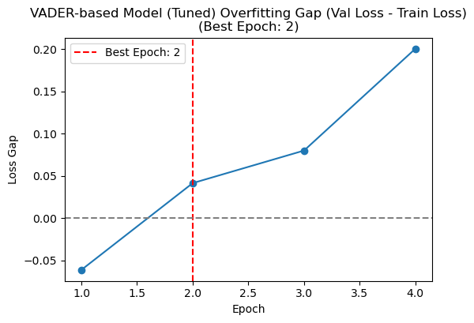
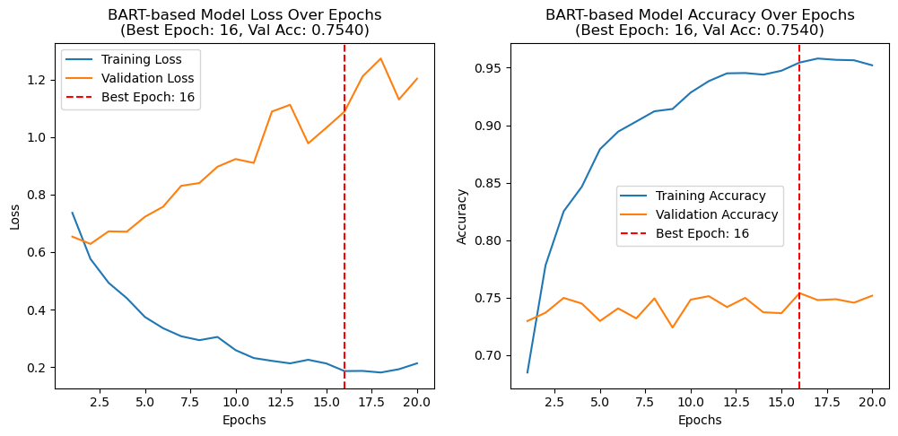
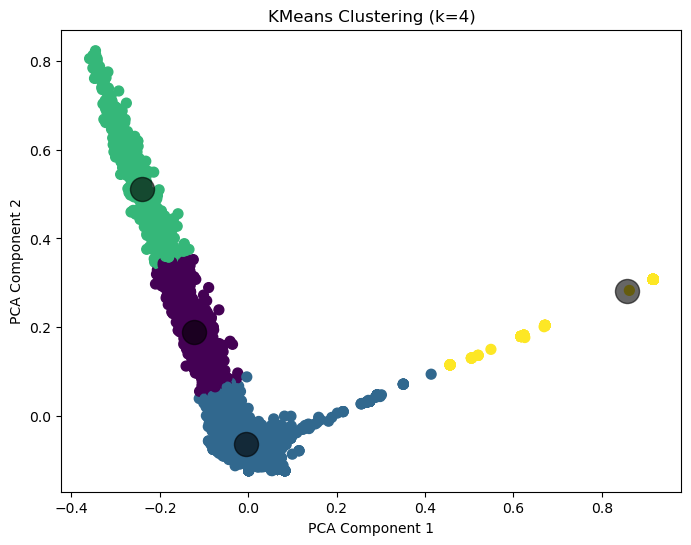
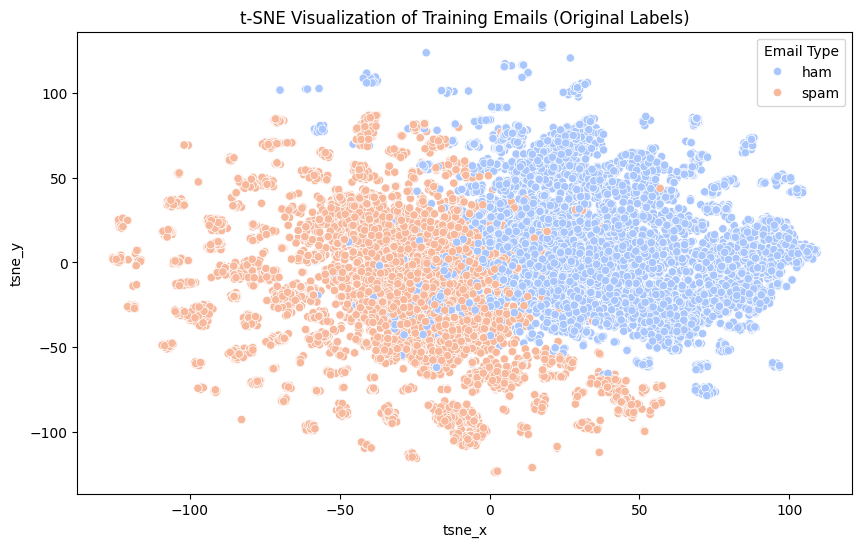

# Mail-Sentiment-Analyzer

    

> Spam detection and sentiment analysis on the Enron email dataset using unsupervised clustering, Bi-LSTM deep learning, and fine-tuned transformer ensembles — 13 model configurations evaluated end-to-end.

------------------------------------------------------------------------

## Results

| Task               | Model                  | Accuracy   | F1   |
|--------------------|------------------------|------------|------|
| Spam Detection     | Bi-LSTM (all configs)  | **99%**    | 0.99 |
| Spam Detection     | BERT-base / DistilBERT | **99%**    | 0.99 |
| Sentiment Analysis | VADER-based BiLSTM     | **92.93%** | —    |
| Sentiment Analysis | BART-based BiLSTM      | 73.95%     | —    |

Evaluated on 6,743 unseen test emails (spam) and 5-fold stratified cross-validation (sentiment). Fine-tuned DeBERTa-v3 and Twitter-RoBERTa ensembles used for transformer-based sentiment inference.

------------------------------------------------------------------------

## Visuals

**VADER BiLSTM — clean convergence in 4 epochs:**



**BART BiLSTM — label noise causes overfitting gap \>1.0 by epoch 20:**



**KMeans Clustering (k=4) — 4 semantically distinct email clusters:**



**t-SNE — ham/spam separation in embedding space:**



------------------------------------------------------------------------

## What It Does

Three independent pipelines on the Enron dataset (enron1–enron6):

**Spam Detection** — TF-IDF + SVD → KMeans/Hierarchical clustering → cluster features fed into 4 Bi-LSTM configurations with 5-fold CV. Also fine-tuned BERT-base and DistilBERT directly for spam classification.

**Sentiment Analysis** — TF-IDF + PCA → KMeans (k=4, elbow method) → VADER and BART zero-shot used as pseudo-labels → tuned Bi-LSTM via Keras Tuner RandomSearch (10 trials).

**Transformer Ensemble** — Fine-tuned `microsoft/deberta-v3-base` and `cardiffnlp/twitter-roberta-base-sentiment` with 5-fold stratified CV. Hybrid soft-voting ensemble (Twitter-RoBERTa 0.8, DeBERTa 0.2) + DistilRoBERTa emotion detection.

------------------------------------------------------------------------

## Tech Stack

| Area | Tools |
|----|----|
| Deep Learning | PyTorch, TensorFlow/Keras |
| Transformers | HuggingFace — DeBERTa-v3, Twitter-RoBERTa, FinBERT, DistilBERT, BERT |
| Classical ML | scikit-learn — TF-IDF, KMeans, Hierarchical, SVD, t-SNE |
| NLP | NLTK — VADER, tokenization, lemmatization |
| Tuning | Keras Tuner (RandomSearch) |

------------------------------------------------------------------------

## Quick Start

``` bash
git clone https://github.com/Yashb0299/Mail-Sentiment-Analyzer
cd Mail-Sentiment-Analyzer
pip install -r requirements.txt
```

Download the Enron dataset from [Kaggle](https://www.kaggle.com/datasets/wanderfj/enron-spam) and place the `archive/` folder in the project root.

``` bash
# Spam detection
jupyter notebook unsupervised_spam.ipynb
jupyter notebook supervised_spam.ipynb

# Sentiment analysis
jupyter notebook unsupervised_sentiment.ipynb

# Transformer ensemble
python finetune_bert.py --data data/labels.csv
python inference_evaluation.py
python visualization.py
```

------------------------------------------------------------------------
